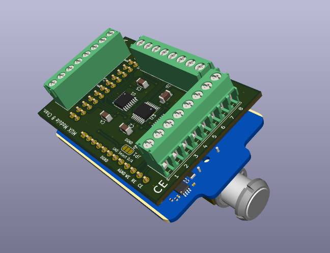
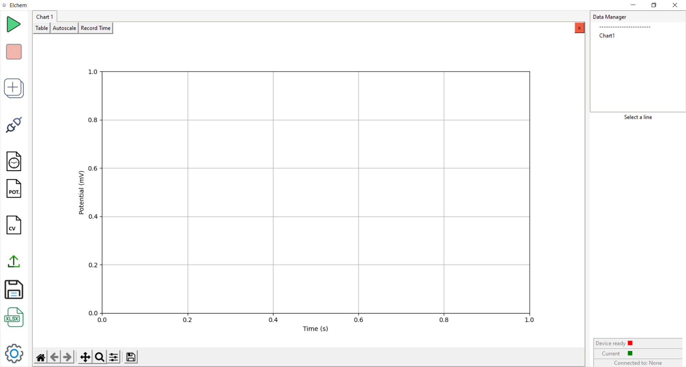

This project was developed using **Python 3.8** for the software and **KiCad 7.0** for the hardware design.

---

# About

This repository provides **OpenMux**, a homemade, cost-effective multiplexer adaptor for the EmStat4 potentiostat ([PalmSens](https://www.palmsens.com/product/emstat4m/)). The adaptor is integrated with the potentiostat using the **MethodScript** protocol provided by the manufacturer. This work is published at a peer review journal (add here doi)

The system consists of two main modules:  

1. **Hardware Module** – the multiplexer adaptor itself.  
2. **Graphical User Interface (GUI)** – a Python-based interface to control the adaptor.  

- Hardware schematics and Gerber files can be found in the `Hardware/` folder.  
- The GUI is located in the `Application/` folder.  

  
  

---

# Costs

The approximate cost of the electronic components (excluding the PCB) is around **€40**. Key components include:

| Quantity | Component | Price | Link |
|----------|-----------|-------|------|
| 3x       | ADG1408YRUZ Multiplexer | €10 | [Digi-Key](https://www.digikey.pt/en/products/detail/analog-devices-inc/ADG1408YRUZ/1206709?msockid=3b4fa386dcfd658b16a1b206dd9a641a) |
| 3x       | Phoenix Terminal Block 8-pos | €1.60 | [Digi-Key](https://www.digikey.pt/en/products/detail/phoenix-contact/1984675/950853) |
| 3x       | Male Pin Header 12-pos | €0.14 | [Digi-Key](https://www.digikey.pt/en/products/detail/adam-tech/PH1-12-UA/9830395) |
| 3x       | Female Pin Header 12-pos | €0.49 | [Digi-Key](https://www.digikey.pt/en/products/detail/w%C3%BCrth-elektronik/61301211821/16608531) |

---


# Getting Started

1. **Download the repository**  

2. **Build the OpenMux adaptor**  
   - Send the Gerber files for fabrication to any PCB manufacturer (e.g., JLCPCB, PCBWay).  
   - Order the components and assemble the board.  

3. **Install the software**  
   - The OpenMux is not necessary to start using the GUI (whitout the multiplexing features). Just start it, connect the potentiostat to the computer and press play.

4. **Mount the OpenMux adaptor** onto the EmStat4.  

5. **Launch the GUI** and connect the modified device to your computer via USB.

---


# Hardware

The schematics and PCB design were developed using **KiCad**.  

- Gerber files for production can be found in:  `Hardware/production/Mux_Module.zip`
- These files were generated using the **KiCad Fabrication Toolkit** plugin.  

---


# Running the Application

1. Create a Python virtual environment inside the `Application` directory:

```bash
...\OpenMux> cd Application
...\Application> python -m venv venv
```

2. Initialize the virtual environment:

```bash
...\Application> venv\Scripts\activate.bat
```

3. Install the dependencies:

```bash
(venv) ...\Application> pip install -r requirements.txt
```

4. Start the application:

```bash
(venv) ...\Application> python EL_MUX.py
```


# Building an Executable

1. Activate the Python environment:
```bash
...\Application> venv\Scripts\activate.bat
```

2. Run the pyinstaller command:

```bash
(venv) ...\Application> pyinstaller -w -p "venv\Lib\site-packages" -i Icons\group-30_116053.ico --onefile EL_MUX.py
```

This will generate:

A .spec file

Two additional directories: build/ and dist/

The dist/ directory contains the EL_MUX.exe (executable).
⚠️ Note: This executable still depends on the following folders:

MethodScript-firmware/

Icons/

Therefore, move EL_MUX.exe to the Application/ directory and ensure those folders are present there. Afterward, the build/ and dist/ directories are safe to be deleted.


# License

- Software (Application/) is licensed under MIT License.  
- Hardware (Hardware/) is licensed under CC BY 4.0.  


# References

(Add our publication)